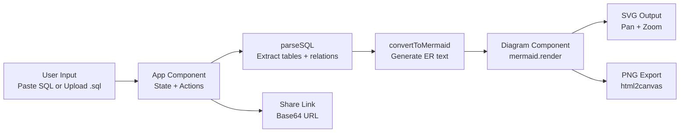

# Architecture

This document describes the current architecture of SQL2ER and how SQL input moves through parsing, transformation, and rendering.

## System Overview

SQL2ER is a client-side React application that converts SQL CREATE TABLE statements into Mermaid ER diagrams.



## Runtime Layers

1. Presentation Layer

- React UI controls in App for input, file upload, and action buttons.
- Diagram renders generated Mermaid code into SVG.

2. Transformation Layer

- parseSQL converts raw SQL text into an intermediate model:
  - tables: map of table name to column list
  - relations: list of table relationships
- convertToMermaid serializes the intermediate model into Mermaid ER syntax.

3. Integration Layer

- Mermaid renders ER diagram SVG.
- html2canvas captures rendered diagram and exports PNG.
- Browser APIs support file reading (FileReader) and clipboard sharing.

## Main Modules

- src/App.js
  - Owns application state (sql, diagram, error)
  - Handles user input and file upload/drop
  - Runs parse/generate pipeline
  - Exposes export and share actions

- src/Diagram.js
  - Receives Mermaid code via props
  - Renders SVG through mermaid.render
  - Adds diagram interaction: mouse drag + wheel zoom
  - Cleans up event listeners on rerender/unmount

## Data Model

Intermediate parsed structure used between parsing and Mermaid conversion:

```text
{
  tables: {
    tableName: [
      { name: string, type: string, key: "" | "PK" | "FK" | "UQ" | "PK UQ" }
    ]
  },
  relations: [
    { from: string, to: string }
  ]
}
```

## Request/Action Flows

1. Generate Diagram

- User clicks Generate.
- App validates SQL input.
- parseSQL extracts entities/relationships.
- convertToMermaid generates Mermaid text.
- Diagram renders SVG.

2. Upload SQL File

- User drags file or selects one in hidden input.
- FileReader reads text content.
- SQL text area state updates.

3. Export PNG

- App selects rendered Mermaid container.
- html2canvas creates bitmap snapshot.
- Browser downloads schema.png.

4. Share

- SQL is UTF-8 encoded and base64-converted.
- App copies generated URL to clipboard.

## Constraints and Tradeoffs

- Parsing currently uses regex logic tuned for common CREATE TABLE patterns.
- Not all SQL dialect edge cases are covered.
- Client-only architecture keeps deployment simple but places parsing/render work in browser runtime.

## Extension Points

- Replace parseSQL with node-sql-parser for deeper dialect support.
- Add robust relationship cardinality detection.
- Support SVG export in addition to PNG.
- Add URL bootstrap on load by decoding data query parameter.
- Introduce parser tests for SQL variants and regression coverage.

## Deployment Shape

- Build output is static assets generated by Create React App.
- Can be hosted on any static hosting platform.
