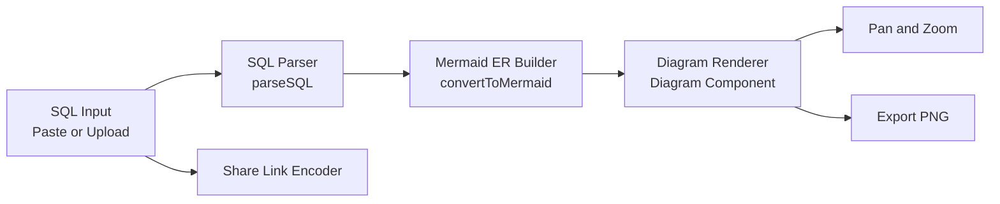

# SQL2ER

Convert SQL table definitions into interactive ER diagrams in seconds.


## Project Overview

SQL2ER is a React app that helps you visualize database structure quickly by turning SQL `CREATE TABLE` statements into Mermaid ER diagrams.

### Key Features

- Paste SQL directly or upload a `.sql` file.
- Parse table columns and foreign key relations.
- Generate Mermaid ER code from SQL schema.
- Render diagrams in-browser with pan and zoom.
- Export rendered diagram as PNG.
- Copy shareable links with encoded SQL input.

## Tech Stack

- React 19
- Mermaid 11
- node-sql-parser
- html2canvas
- Create React App

## Architecture



## Example ER Diagram

```mermaid
erDiagram
		USERS {
				INT id PK
				VARCHAR name
				VARCHAR email UQ
		}

		ORDERS {
				INT id PK
				INT user_id FK
				DECIMAL total
		}

		USERS ||--o{ ORDERS : has
```

## Getting Started

### Prerequisites

- Node.js 18+
- npm 9+

### Install

```bash
npm install
```

### Run Locally

```bash
npm start
```

Open `http://localhost:3000` in your browser.

### Build

```bash
npm run build
```

## How To Use

1. Paste SQL or upload a `.sql` file.
2. Click Generate.
3. Explore the ER diagram using drag and wheel zoom.
4. Export PNG or click Share to copy a link.

## Supported SQL Pattern

The current parser focuses on practical `CREATE TABLE` syntax with inline and table-level foreign key references.

```sql
CREATE TABLE users (
	id INT PRIMARY KEY,
	name VARCHAR(100),
	email VARCHAR(120) UNIQUE
);

CREATE TABLE orders (
	id INT PRIMARY KEY,
	user_id INT,
	FOREIGN KEY (user_id) REFERENCES users(id)
);
```

## Scripts

- `npm start` starts development server
- `npm run build` creates production build
- `npm test` runs test runner
- `npm run eject` ejects CRA config

## Roadmap

- Better SQL dialect coverage
- Relationship labels from constraints
- SVG export option
- Theme switch for diagram rendering

## Repository

- Owner: Chhatrapati-sahu-09
- Repository: SQL2ER
- Branch: main

## License

MIT

## Docs Micro-Update Log

- v1: README rewritten for project-specific documentation.
- v$i: small README polish update.
- v3: small README polish update. 
- v4: small README polish update. 
- v5: small README polish update. 
- v6: small README polish update. 
