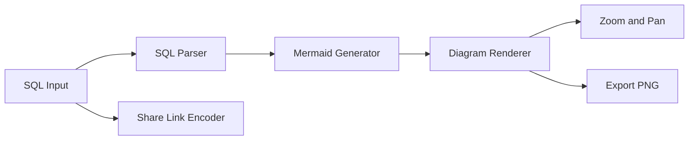
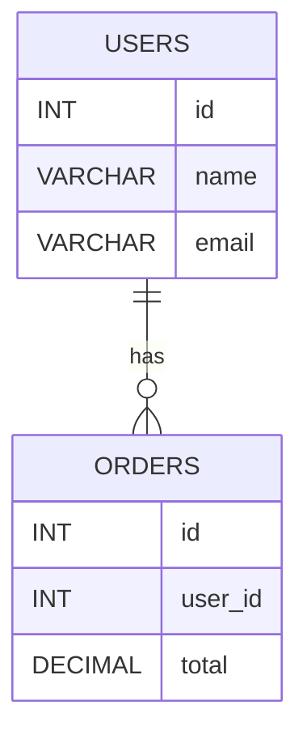

# SQL2ER

> Convert SQL table definitions into interactive ER diagrams instantly.

<p align="left">
  
</p>

<p align="left">
  
  
  
  
  
</p>

---

## Overview

SQL2ER is a developer-focused tool that converts SQL `CREATE TABLE` statements into structured and interactive ER diagrams.
It simplifies database visualization and helps developers understand schema relationships without manual diagram creation.

---

## Features

- SQL input via paste or `.sql` file upload
- Automatic parsing of tables, columns, and relationships
- Foreign key relationship detection and mapping
- Dynamic ER diagram generation using Mermaid
- Zoom and pan for navigating large schemas
- Export diagrams as PNG images
- Shareable links with encoded SQL input
- Error handling for invalid SQL

## Screenshots

<p align="center">
  
  
  
</p>

## Technical Details

### Tech Stack

- **Frontend:** React, JavaScript, HTML, CSS
- **Parsing Engine:** node-sql-parser (AST-based SQL parsing)
- **Visualization:** Mermaid.js
- **Utilities:** html2canvas, panzoom
- **Tooling:** Create React App, npm

---

### Architecture



---

## Example Output



> Note: Primary and foreign key indicators are handled internally in the application but omitted here for GitHub compatibility.

---

## Getting Started

### Prerequisites

- Node.js 18+
- npm 9+

---

### Installation

```bash
git clone https://github.com/Chhatrapati-sahu-09/SQL2ER.git
cd SQL2ER
npm install
```

---

### Run Locally

```bash
npm start
```

Open: http://localhost:3000

---

### Build for Production

```bash
npm run build
```

---

## Usage

1. Paste SQL or upload a `.sql` file
2. Click **Generate**
3. Explore the ER diagram using zoom and drag
4. Export as PNG or generate a shareable link

---

## Supported SQL

Optimized for common `CREATE TABLE` statements with primary and foreign key constraints.

```sql
CREATE TABLE users (
  id INT PRIMARY KEY,
  name VARCHAR(100),
  email VARCHAR(120) UNIQUE
);

CREATE TABLE orders (
  id INT PRIMARY KEY,
  user_id INT,
  FOREIGN KEY (user_id) REFERENCES users(id)
);
```

---

## Project Structure

```
src/
 ├── components/
 │   ├── Diagram.js
 │
 ├── App.js
 ├── App.css
 └── index.js
```

---

## Roadmap

- Extended SQL dialect support
- Relationship labeling improvements
- SVG export support
- Theme customization

---

## Author

Chhatrapati Sahu
GitHub: https://github.com/Chhatrapati-sahu-09

---

## License

MIT License

---

## Acknowledgements

- Mermaid.js for diagram rendering
- node-sql-parser for SQL parsing
- Open-source ecosystem for supporting tools

---
